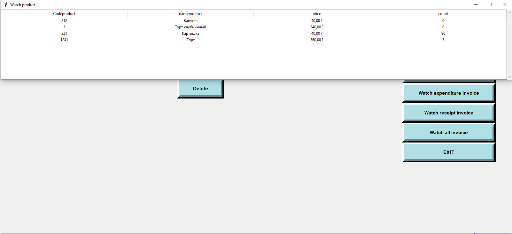

- [:ru: RUS](./README.ru.md) - Русская документация
- [:uk: ENG](./README.md) - English documentation

# About
Inventory records tracking client-side app powered on Python and tkinter as a GUI framework. It uses PostgreSQL as a storage.

Authentication window

Main menu

Viewing products

