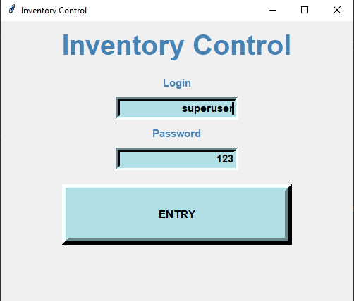
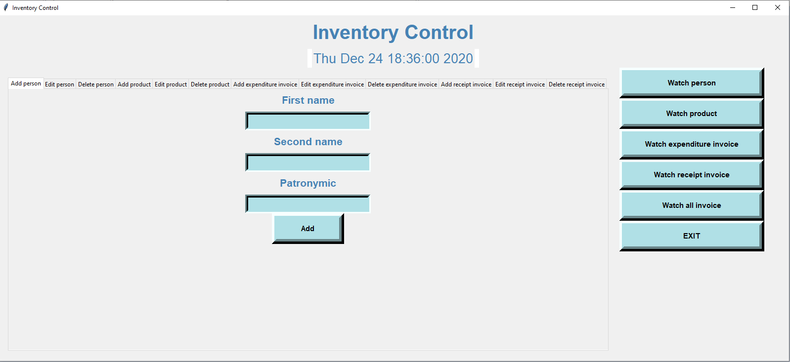
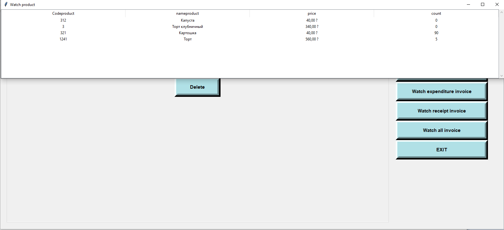

# :construction: 

- [:ru: RUS](./README.ru.md) - Русская документация
- [:uk: ENG](./README.md) - English documentation

# О приложении
Клиентское приложение для отслеживания складского учёта.
Язык разработки - Python, для отображения графического интерфейса использована библиотека tkinter. В качестве хранилища используется PostgreSQL

Окно аутентификации

Главное меню

Просмотр товаров

